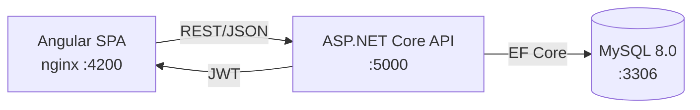

# Engagement Tracker

A full-stack client engagement management portal where consulting associates log time, managers track budgets, and partners view firm-wide billing summaries. Built with **ASP.NET Core 8** and **Angular 21**.

[](https://github.com/Jared-Waldroff/engagement-tracker/actions/workflows/ci.yml)

---

## Features

- **Role-based access control** — three distinct roles (Associate, Manager, Partner) with JWT authentication and scoped data visibility
- **Engagement management** — create, update, and track client engagements with status lifecycle (Planning → Active → On Hold → Completed → Cancelled)
- **Time entry logging** — associates log hours against engagements; entries are filtered by role
- **Budget tracking** — real-time budget utilization with On Track / At Risk / Over Budget status indicators
- **Dashboard** — role-aware summary with stat cards, budget donut charts, and top engagements table
- **Structured logging** — Serilog with console and rolling file sinks
- **API documentation** — Swagger UI available in development mode
- **Containerized deployment** — Docker Compose runs the full stack (MySQL + API + UI) with one command
- **Continuous integration** — GitHub Actions runs backend tests and frontend build on every push

## Tech Stack

| Layer | Technology |
|-------|-----------|
| **Backend** | ASP.NET Core 8, C# 12 |
| **Frontend** | Angular 21, TypeScript 5.9, Angular Material |
| **Database** | SQLite (dev) / MySQL 8.0 (Docker) with EF Core |
| **Auth** | JWT Bearer tokens with BCrypt password hashing |
| **Validation** | FluentValidation |
| **Logging** | Serilog (structured, file + console) |
| **Testing** | xUnit, Moq, Microsoft.AspNetCore.Mvc.Testing |
| **DevOps** | Docker Compose, multi-stage Dockerfiles, GitHub Actions CI |

## Architecture



```
EngagementTracker.sln
├── src/
│   ├── EngagementTracker.Api          # Controllers, middleware, DI config
│   │   ├── Controllers/               # AuthController, EngagementsController, TimeEntriesController
│   │   ├── Extensions/                # Service registration, HttpContext claim helpers
│   │   ├── Middleware/                # Global exception handler → consistent JSON errors
│   │   └── Dockerfile                # Multi-stage build (SDK → runtime)
│   │
│   ├── EngagementTracker.Core         # Domain logic (no infrastructure dependencies)
│   │   ├── Dtos/                      # Request/response DTOs (never expose EF entities)
│   │   ├── Enums/                     # UserRole, EngagementStatus
│   │   ├── Exceptions/               # NotFoundException, ForbiddenException, ValidationException
│   │   ├── Interfaces/               # Service + repository contracts
│   │   ├── Services/                  # EngagementService, TimeEntryService, AuthService, BudgetCalculator
│   │   └── Validators/               # FluentValidation rules
│   │
│   ├── EngagementTracker.Infrastructure  # Data access layer
│   │   ├── Data/                      # AppDbContext, DbSeeder (realistic sample data)
│   │   ├── Entities/                  # EF Core entities (User, Client, Engagement, TimeEntry)
│   │   └── Repositories/             # Repository implementations
│   │
│   └── engagement-tracker-ui          # Angular SPA
│       ├── src/app/
│       │   ├── core/                  # Services, guards, interceptors, models
│       │   ├── features/              # Auth, Dashboard, Engagements, Time Entries
│       │   └── shared/               # Reusable components (budget bar, status badge, loading skeleton)
│       ├── Dockerfile                 # Multi-stage build (Node → nginx)
│       └── nginx.conf                 # SPA routing + API reverse proxy
│
├── tests/
│   └── EngagementTracker.Tests
│       ├── Unit/                      # Service + BudgetCalculator tests
│       └── Integration/              # Full HTTP pipeline tests with TestWebApplicationFactory
│
├── docker-compose.yml                 # Full stack: MySQL + API + UI
└── .github/workflows/ci.yml          # Backend tests + frontend build (parallel)
```

The backend follows **Clean Architecture** — the Core project has zero infrastructure dependencies. All I/O flows through interfaces, wired up via dependency injection in `ServiceCollectionExtensions`.

## Quick Start with Docker

The fastest way to run the full stack:

```bash
docker compose up --build
```

This starts three containers:
- **MySQL 8.0** on `localhost:3306` — database with health checks
- **ASP.NET Core API** on `localhost:5000` — REST API with Swagger at `/swagger`
- **Angular UI** on `localhost:4200` — frontend with nginx reverse proxy

The database is automatically created and seeded with sample data on first startup.

## Local Development

### Prerequisites

- [.NET 8 SDK](https://dotnet.microsoft.com/download/dotnet/8.0)
- [Node.js 20+](https://nodejs.org/) and npm

### Run the API

```bash
cd src/EngagementTracker.Api
dotnet run
```

The API starts on `http://localhost:5062` with SQLite. The database is automatically created and seeded with sample data on first run.

Swagger UI is available at `http://localhost:5062/swagger` in development mode.

### Run the Frontend

```bash
cd src/engagement-tracker-ui
npm install
npm start
```

The Angular app runs on `http://localhost:4200` and proxies API requests to the backend.

### Run Tests

```bash
dotnet test
```

Runs both unit tests (service logic, budget calculations) and integration tests (full HTTP pipeline with in-memory SQLite).

## API Endpoints

| Method | Route | Auth | Description |
|--------|-------|------|-------------|
| `POST` | `/api/auth/login` | Public | Authenticate with email/password, returns JWT |
| `GET` | `/api/auth/profile` | Required | Current user profile |
| `GET` | `/api/engagements` | Required | List engagements (filtered by role) |
| `GET` | `/api/engagements/{id}` | Required | Engagement detail with time entries and budget breakdown |
| `POST` | `/api/engagements` | Manager+ | Create a new engagement |
| `PUT` | `/api/engagements/{id}` | Manager+ | Update an engagement |
| `GET` | `/api/engagements/dashboard` | Required | Role-aware dashboard statistics |
| `GET` | `/api/time-entries` | Required | List time entries (filtered by role, optional engagement filter) |
| `POST` | `/api/time-entries` | Required | Log a new time entry |

## Demo Credentials

The database seeder creates three users, one for each role:

| Role | Email | Password |
|------|-------|----------|
| Associate | `alice@example.com` | `password123` |
| Manager | `bob@example.com` | `password123` |
| Partner | `carol@example.com` | `password123` |

Each role sees different data:
- **Associates** see engagements they've logged time against
- **Managers** see engagements they manage, can create and edit engagements
- **Partners** see all engagements firm-wide

## Design Decisions

- **Clean Architecture** — Core has zero infrastructure dependencies, making business logic testable without a database or web server
- **DTOs separate from entities** — API contracts are independent of the database schema, allowing either to evolve without breaking the other
- **Role-based filtering in the service layer** — controllers stay thin; access control logic is centralized and testable
- **FluentValidation over data annotations** — validation rules are explicit, composable, and unit-testable
- **Multi-stage Docker builds** — SDK images compile the code, then only the compiled output is copied into minimal runtime images

## Environment Variables

| Variable | Default | Description |
|----------|---------|-------------|
| `DB_ROOT_PASSWORD` | `localdev` | MySQL root password (Docker only) |
| `JWT_SECRET` | dev key | JWT signing secret (min 32 chars) |
| `DatabaseProvider` | `Sqlite` | `Sqlite` for local dev, `MySql` for Docker |
| `ConnectionStrings__Default` | SQLite file | Database connection string |

See `.env.example` for a complete template.

## License

This project was built as a portfolio demonstration.
